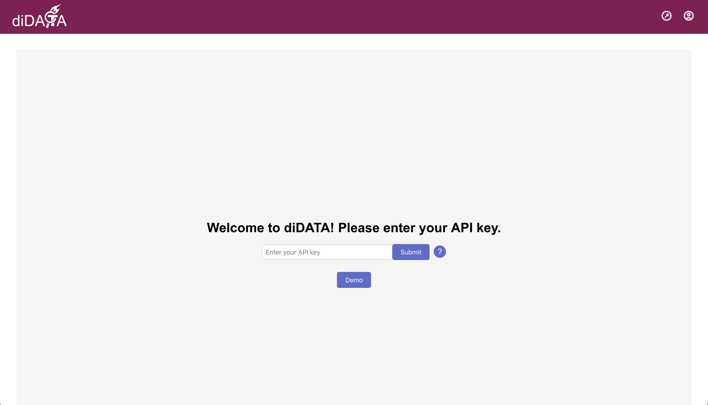
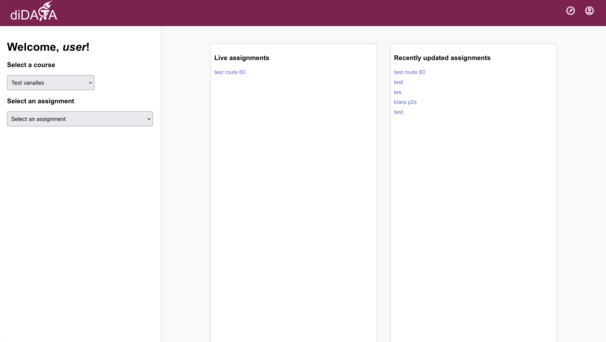
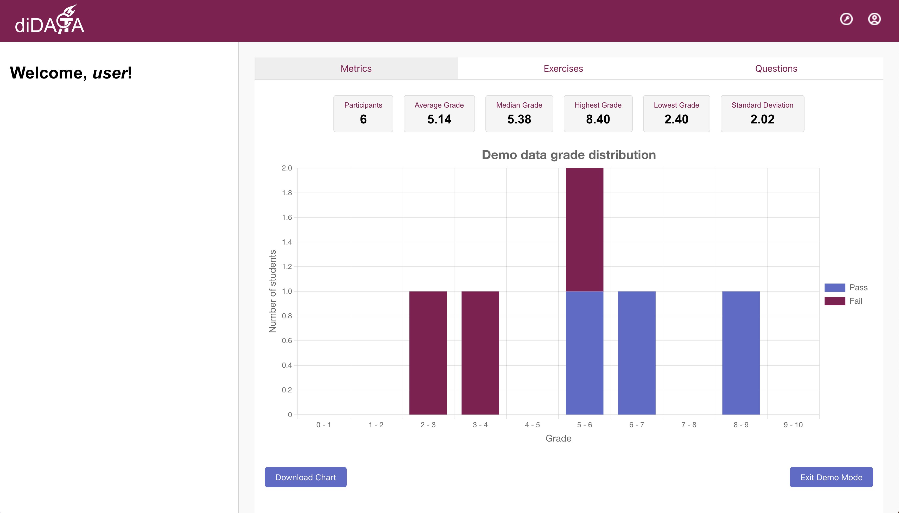
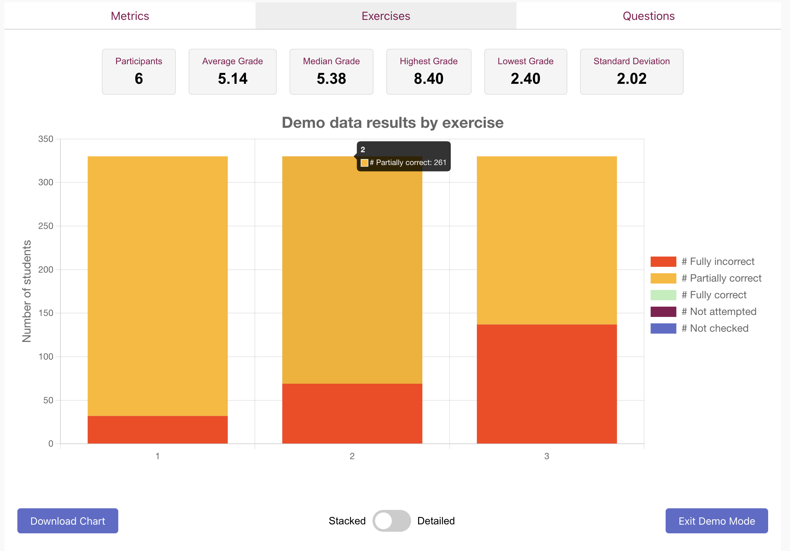
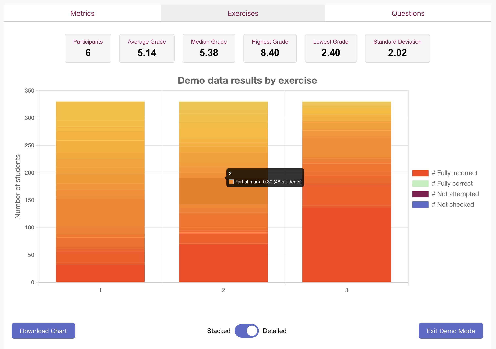
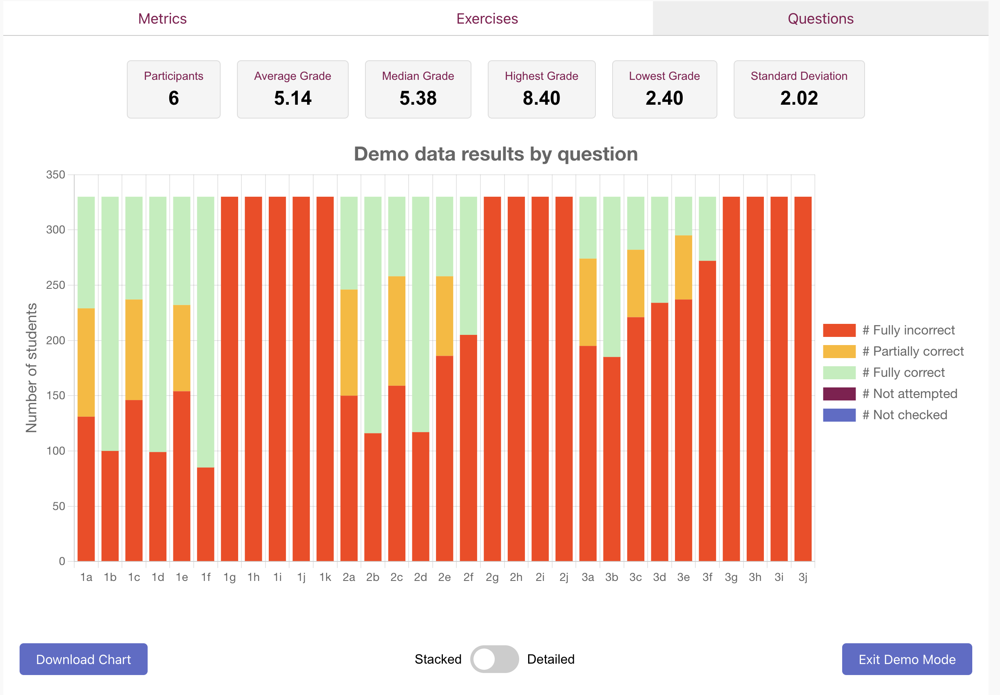
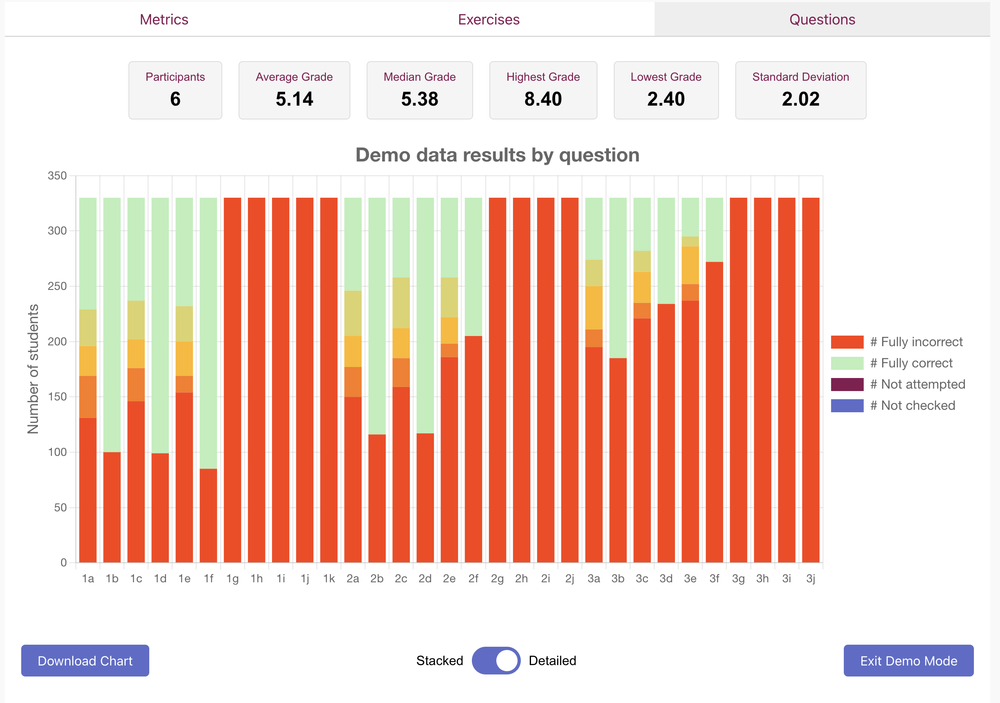

# diDATA

This repository contains the source code of diDATA. diDATA is a web application that makes it easier for professors, course managers and lecturers to analyse the results of the students by providing detailed visualisations of these results. It has been developed for TU Delft under the PRIMECH project and builds upon the functionalities offered by the ANS platform. In comparison to ANS, diDATA offers a much more detailed view of ...

## Structure of the Application

The application uses a Django backend and a React frontend. The responsibilities of the backend and frontend are fully separated and both can run fully independently. The frontend and backend communicate through API calls and the responses are returned to the frontend as JSON messages.

The backend uses a PostgreSQL database. This database is used to store the assignment data queried from ANS to avoid repeated API calls for large amounts of assignment data.

The repository is structured as follows:
```
/frontend
--/

/backend
```

To locally run the frontend, enter the following commands:
```
cd frontend
npm start
```

To locally run the backend, enter the following commands in a separate terminal window:
```
cd backend
python manage.py runserver
```

To locally set up the database, enter the following commands:
```
makemigrations etc
```

Before running those commands, ensure that you have installed all the necessary dependencies. These dependencies are descibed in the next section.

## Dependencies

- Python 3 installed
- NPM installed
- all of the backend deps can be installed using pip install -r requirements.txt
- all of the frontend deps can be installed using ...
- Postgres installed

## An Overview of the Functionalities

Currently, the app includes a simple Login page, a Data page where the user can see detailed metrics about their chosen assignment, and a Settings page. The Login page looks as follows:



In the API key field, the user has to enter their ANS API key. For users who don't have an API key yet, but who are interested in how the app functions, there is a Demo page that includes all of the functionalities of the Data page, but presents demo data that doesn't correspond to any real assignment.

The Data page includes a side menu where the user can choose the Course and the Assignment for which they wish to view the data. Once the user has chosen a course, the 5 most recently updated and currently live assignments are shown for that course:



Once the user has also chosen an assignment, either from the dropdown menu on the side or from the list of most recently updated or live courses, the Charts page will be shown that displays detailed data about the assignment:



The Charts page has three views: Metrics, Exercises, and Questions. Metrics, as shown on the figure above, display the grade distribution and some summary statistics about the entire assignment. The Exercises page looks as follows:



Exercises usually consist of multiple questions, and this page gives an overview of the students' submissions aggregated by exercise. There are two views: Stacked and Detailed. In the Stacked view, the user can get a rough overview of the students' performance: for each exercise, 5 bars are shown, corresponding to:
1. The number of students who answered all of the questions under the given exercise correctly
2. The number of students who answered all of the questions under the given exercise incorrectly
3. The number of students who got some of the questions under the given exercise correct and some incorrect
4. The total number of questions under the given exercise that were unattempted
5. The total number of questions under the given exercise that were unchecked

In the detailed view, the exact marks of the students who answered some of the questions correctly and other questions incorrectly are shown. The exact score and the number of students who attained that score can be seen by hovering over the bar of interest:



Finally, there is the Questions page, which presents the most detailed overview of the results. This page looks as follows:



For each question, the following data is shown:
1. The number of students who answered the question correctly
2. The number of students who answered the question incorrectly
3. The number of students who were given a partial mark for the question (again, there is also the Detailed mode that presents a detailed breakdown of the partial marks)
4. The number of students who left the question unattempted
5. The number of students for whom the question was unchecked

The Questions page also has a detailed view:



Each view includes two buttons: the Download button and the Update button (not shown in the demo mode). The Download button enables the user to download the currently opened chart as a PNG file. The Update button enables the user to make an API call to ANS to refresh the data, since by default, the data will be served from diDATA's own database. For live assignments, the data stored in diDATA's database can be outdated and the Update button enables the retrieval of the latest results.

This functionality is useful because ...

Finally, the application also includes a Settings page. This page gives the user the opportunity to view their API key, to remove it from the system, and to enable the dark mode.

## Future Improvements

- The most important improvement is to integrate the app with the TU Delft Single Sign-On system, which will enable its deployment on TU Delft's servers. Alongside this improvement, user profiles should be created and user ANS API keys should be stored in a safer way than now - currently, they are stored in the local storage of the users' browsers.
- The charts could have an 'Explain' button which gives a detailed overview of what the charts exactly show, how the 'Stacked' and 'Detailed' modes work, how the scores for the individual questions are aggregated in the Exercise view, etc
- There could be a button for submitting feature requests that lecturers can use to suggest improvements to the app
- The dropdown menus for choosing the courses and assignments could include slightly more detailed information about the courses and assignments, such as the year and quarter in which the course was run. In case it appears during deployment that some lecturers have a very long list of courses to choose from, another dropdown menu could be added that first enables the users to choose the year when the course was run.